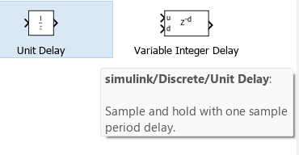
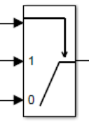

# My Thought process

In order to translate the simulink models into c code we need to first understand the different blocks, here is a list of the unusual ones I found:

## 1) The unit delay

## 2) The switch

## 3) The multiport switch:

:

    It selects one of the two input signals (the two lower ones)and outputs it, based on a control (selector) R.