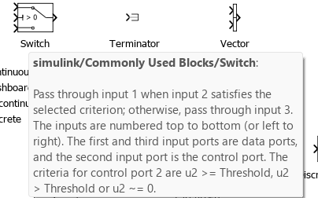

# My Thought process

In order to translate the simulink models into c code we need to first understand the different blocks, here is a list of the unusual ones I found:

## 1) The unit delay

## 2) The switch

## 3) The multiport switch:

:

    It selects one of the two input signals (the two lower ones)and outputs it, based on a control (selector) R.

types of blocs: a finir (ask hajar)

R, Cnt: unsigned char
upper, lower: unsigned int
input: int
otput unsigned int

b0,b1,b2, bitField: short

we need top level systeme to develop MIL